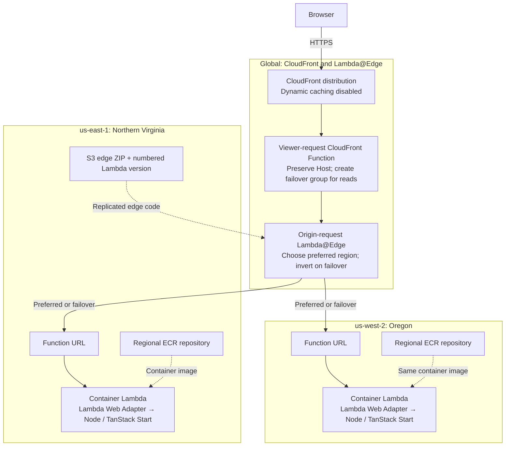

# TanStack Start on AWS: two-region active/active

A stateless, strictly typed TanStack Start example running the **same container image** in
**`us-east-1` and `us-west-2`**, using Lambda Web Adapter, Lambda@Edge and CloudFront.
Infrastructure is plain **CloudFormation**, not CDK, SAM, or Terraform.

> This is an executable reference example, not a production availability guarantee.
> AWS active/active routing and both-direction HTTP failover were verified on 2026-09-26.
> Re-run verification for your deployment. CloudFront **does not automatically retry writes**.

## Application events test branch

This branch pins published `@ataylorme/tanstack-workflow-aws@0.2.0-rc.0` from
GitHub Packages ([upstream PR #4](https://github.com/ataylorme/tanstack-workflow-aws/pull/4))
and adds a browser application-event lab with authenticated publishing, cross-region
retry/conflict checks, and real DynamoDB Stream-to-SQS delivery observation.
See the [event testing runbook](docs/application-event-testing.md) and
[validation status](docs/application-event-validation.md).

## Workflow testing branch

This branch adds an isolated, token-protected TanStack Workflow AWS integration lab.
See [deployment and testing](docs/workflow-testing.md) and [validation evidence](docs/workflow-validation.md).
Use `ENABLE_WORKFLOW_TESTS=true` with a separate stack prefix; do not overwrite the main site.

## Start here

- **[Use the repository](docs/getting-started.md)** — clone, run locally, test, build the
  container, change code, and troubleshoot development.
- **[Deploy to AWS](docs/deployment.md)** — prerequisites, account preflight, deployment,
  updates/recovery, secret handling, verification, failure drills, and cleanup.

### Quick start

```sh
git clone https://github.com/ataylorme/tanstack-start-aws-high-availability.git
cd tanstack-start-aws-high-availability
git switch test/tanstack-workflow-aws
nvm install && nvm use
# GitHub token needs read:packages and access to the published package.
export NODE_AUTH_TOKEN="$(gh auth token)"
npm ci
npm run dev                   # http://localhost:3000
```

For AWS, first follow the [deployment prerequisites](docs/deployment.md), then run:

```sh
node scripts/deploy.ts         # offline plan only; no AWS calls
# node scripts/deploy.ts --execute creates/updates billable AWS resources
```

See [package authentication](docs/workflow-testing.md#package-authentication) for GitHub Packages setup.
No AWS credentials are needed for local development. Pushing to GitHub runs validation,
not deployment. The AWS example uses publicly invokable Function URLs with an
application-level shared-secret guard, **not IAM origin isolation**; read the
[security tradeoffs](docs/deployment.md#origin-security-deliberate-example-tradeoff).

## Architecture



Solid arrows show request flow; dashed arrows show deployment artifacts. Either region
can be preferred. CloudFront attempts the other region only for eligible read failures,
as detailed below.

Both regions actively serve traffic. By default, a SHA-256 hash of the viewer IP determines the
preferred region, providing affinity without cookies or a shared store. Approximately
half of **clients**, not necessarily half of requests, go to each region; this is not
latency/geolocation routing. NAT users share affinity.

The region buttons are ordinary links (`/?region=us-east-1` and `/?region=us-west-2`)
that reload the page through CloudFront. A secure, HttpOnly session cookie remembers
an explicit choice for subsequent refreshes and server functions. The currently serving
region is highlighted; reads can still fail over if the chosen region is unavailable.
Routing precedence is `X-HA-Region`, then the `region` query parameter, then the
`ha-region` cookie, then IP affinity. Only the two supported region values are accepted.
Region switching requires AWS edge routing; local development remains one server.

CloudFront's configured origins are **attempt slots**, not fixed regional roles:

| Preferred region | Primary attempt | Secondary attempt |
| --- | --- | --- |
| `us-east-1` | `us-east-1` | `us-west-2` |
| `us-west-2` | `us-west-2` | `us-east-1` |

The origin-request function reads the slot from CloudFront's configured custom origin
headers and changes both the origin domain and HTTP Host. It does **not** randomly
pick again on retry. A viewer-request **CloudFront Function (JavaScript runtime 2.0)**
overwrites `X-Forwarded-Host` and creates a request-scoped origin group only for
GET/HEAD/OPTIONS. Writes retain the single-origin behavior and still use Lambda@Edge
regional selection. A static origin-group behavior cannot allow write methods.
The application restores the public HTTPS URL for server functions.
No request body is included in edge events; CloudFront forwards bodies untouched.

### Availability boundaries

- Retry criteria: **429, 500, 502, 503, 504**, plus **404** to allow missing assets to be
  tried in the other region during a rolling release.
- Only **GET, HEAD, OPTIONS** fail over. POST/PUT/PATCH/DELETE still use active/active
  selection, but failures are returned to the caller, not replayed. The POST demo is a
  stateless server function, not a replicated write. Real writes need durable state,
  idempotency and an explicit recovery strategy.
- CloudFront starts at the preferred region on **every request**. There is no persistent
  health circuit breaker. An unavailable preferred region adds failure latency each time.
- Connection attempts: 1; connect timeout: 3 seconds; origin response timeout: 15 seconds.
  These are example values, not an RTO bound; tune for cold starts and SSR duration.
- AWS resolves the configured origin's DNS **before** invoking origin-request Lambda@Edge.
  A DNS-resolution failure can prevent routing code from running. Do not interpret this
  design as protection against every DNS or AWS control-plane failure.
- No database, login/session state, provisioned concurrency, custom domain, WAF, or SLA.
  Buffered Function URL responses use Lambda's buffered response limits (including 6 MB);
  SSR is buffered rather than streamed to the viewer.

## Files and validation

| Path | Purpose |
| --- | --- |
| `src/` | Start SSR UI, typed server functions, origin guard, region metadata |
| `edge/` | Strict typed origin-request router, compiled separately for Lambda@Edge |
| `viewer/` | Strict typed CloudFront Function, packaged by `scripts/viewer-code.ts` |
| `infra/bootstrap.yaml` | Regional ECR and east-region artifact bucket |
| `infra/regional.yaml` | Container Lambda, Function URL permissions, logs and alarms |
| `infra/global.yaml` | Edge function/version, viewer function, CloudFront distribution and policies |
| `scripts/` | Explicit deployment, regional failure toggling, local and live smoke checks |
| `tests/` | Vitest routing, origin security, URL reconstruction and tooling safety tests |
| `.github/workflows/ci.yaml` | Build, strict typecheck, Vitest, smoke, IaC lint and container smoke |

```sh
python3 -m venv .venv
.venv/bin/pip install cfn-lint==1.57.0
.venv/bin/cfn-lint -t infra/*.yaml
```

Nitro's Vite integration is currently a beta dependency; versions are pinned in
`package-lock.json`. Upstream bundling may emit `use client` directive warnings; do not
confuse those with a failed build. Revalidate updates before changing pinned versions.

## Official references

- [TanStack Start Node.js / Docker hosting](https://tanstack.com/start/latest/docs/framework/react/guide/hosting#node-js-docker)
- [TanStack custom server entry](https://tanstack.com/start/latest/docs/framework/react/guide/server-entry-point)
- [AWS Lambda Web Adapter](https://github.com/aws/aws-lambda-web-adapter)
- [CloudFront Functions request-scoped origin groups](https://docs.aws.amazon.com/AmazonCloudFront/latest/DeveloperGuide/helper-functions-origin-modification.html)
- [CloudFront origin failover and repeated edge invocation](https://docs.aws.amazon.com/AmazonCloudFront/latest/DeveloperGuide/high_availability_origin_failover.html)
- [Lambda@Edge dynamic origin selection / event structure](https://docs.aws.amazon.com/AmazonCloudFront/latest/DeveloperGuide/lambda-event-structure.html)
- [Lambda@Edge restrictions](https://docs.aws.amazon.com/AmazonCloudFront/latest/DeveloperGuide/lambda-at-edge-function-restrictions.html)
- [Edge header restrictions](https://docs.aws.amazon.com/AmazonCloudFront/latest/DeveloperGuide/edge-function-restrictions-all.html)
- [Function URL access and both required invocation permissions](https://docs.aws.amazon.com/lambda/latest/dg/urls-auth.html)
