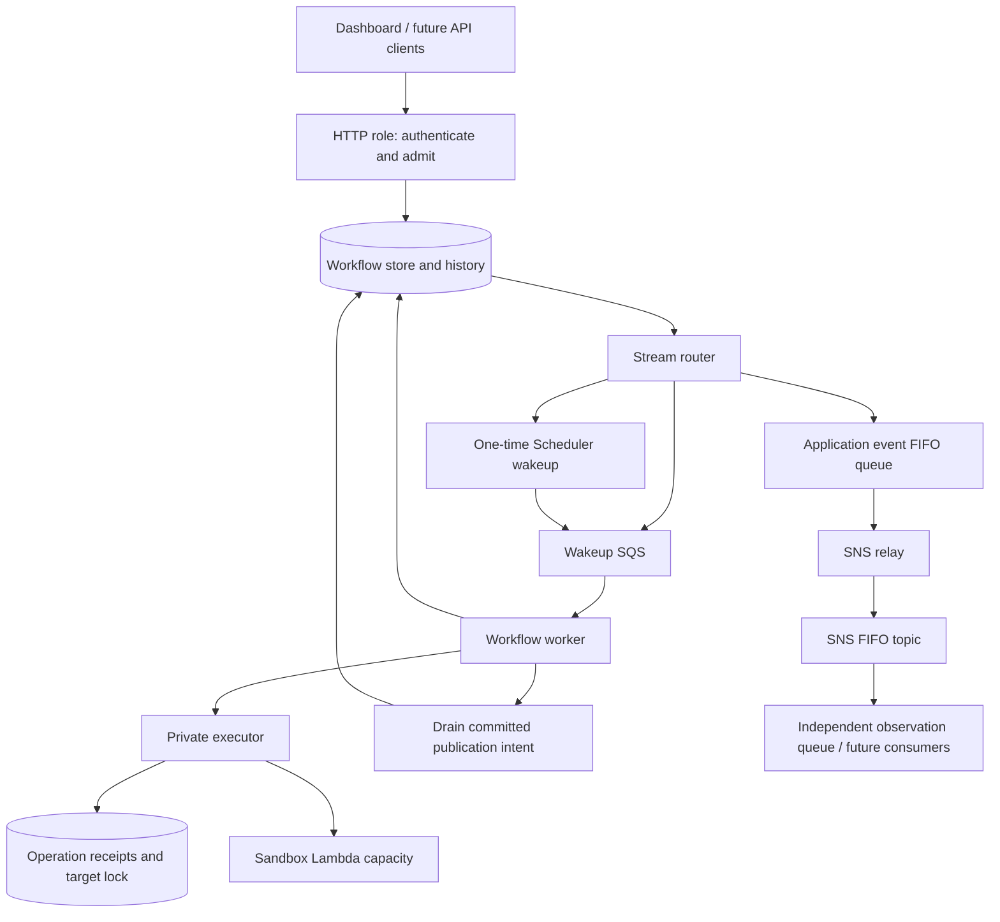

# Architecture: a TypeScript application with durable work

Audience: experienced TypeScript developers who are new to event-driven systems or TanStack Workflow.

[Contributing](../../CONTRIBUTING.md) · [Cookbook](development.md) · [Operations](operations.md) · [Versioning](versioning.md) · [Runbook](../orchestration-poc.md)

## The design objective

The business process should be easier to reason about than its infrastructure. A developer should be able to answer:

1. What does this task do, and who may request/approve it?
2. What is persisted before a process stops?
3. Which operation might happen again after a retry?
4. Why is the task waiting, and what can safely unblock it?
5. Can the next deployment still run yesterday's tasks?

A cohesive TypeScript codebase helps keep those answers together. Strict types, injected ports, local persistence, and one deployable image reduce the amount of AWS infrastructure needed for the inner development loop. The goal is **less cognitive complexity, simpler testing, and simpler deployment**, not fewer lines at any cost.

The POC is a modular application deployed into multiple permissioned roles. It is **not one immortal Node process**, and the single image does not remove queues, durable storage, timers, failures, or distributed ownership. It reduces artifact coordination, not all operational responsibility.

## Vocabulary, mapped to familiar programming concepts

| Term | Practical meaning | Example here |
| --- | --- | --- |
| Command | A request for one owner to attempt an action; it may be rejected | Create a capacity-change task |
| Event | A fact about something that happened, not an instruction disguised as a fact | `devops.task.succeeded.v1` |
| Workflow | Persisted progression through a business process, including waits and recovery | Plan → approve → wait → execute → verify |
| Step | A named durable boundary whose completed result can be reused on replay | `plan`, `execute` |
| Queue | A delivery buffer, not the authoritative task state | Worker wakeup queue |
| Inbox | Durable acceptance of incoming input before processing it | Accepted approval decision |
| Outbox/committed effect | Durable intent to publish an outcome, separated from transport success | Completion-event workflow effect |
| Projection | A read-oriented view derived from authoritative state/history | Dashboard `TaskView` |
| Lease | Time-bounded worker ownership; not a transaction with an external API | Workflow execution lease |
| Idempotency key | Stable identity for one intended operation across retries | Request key or receipt operation ID |
| Reconciliation | Determine what happened by reading durable records and the external system | Observe capacity after an ambiguous timeout |

This is not a requirement to make every application entity event-sourced. Workflow history supports durable execution; application events are published integration facts; operation receipts protect external effects. They have different owners and retention needs.

A queue message being delivered does not mean the task completed. A task completing does not mean every subscriber has processed its event.

## Why mix orchestration and events?

Use a workflow when the platform owns the **sequence and success criteria**. Approval and execution are not independent reactions: execution must not happen until the exact plan is approved.

Use events when other systems should **react independently**. A cache invalidation subscriber can consume a successful-deployment event without being part of the deployment workflow.

The distinction depends on business semantics. If cache invalidation is required before a deployment may be declared successful, model it as a required workflow step instead. If it is an independent consequence, model it as a subscriber with its own retries, metrics, and owner. Do not label a required step "asynchronous" merely to hide its failures.

Avoid building the core approval lifecycle as a chain of handlers such as `request-created → plan-created → approval-created → execution-requested`. That can scatter one business process across many files and queues, recreating the debugging problem this architecture aims to reduce.

## End-to-end path

1. **Admit:** HTTP validates input and an idempotency key, derives actor identity from authorization, and calls `store.createRun`. It does not execute the workflow inline.
2. **Wake:** persisted state produces stream records; the router creates immediate or scheduled wakeups.
3. **Plan:** a worker runs the registered workflow. The `plan` step records the observed capacity, desired capacity, target, timing, version, and hash.
4. **Approve:** the workflow suspends. A decision is durably accepted through `store.deliverApproval`. The request can return before a worker resumes the run.
5. **Wait:** after approval, `ctx.sleepUntil` waits until the planned time. This is durable suspension, not a sleeping Lambda invocation.
6. **Execute:** the worker invokes a private executor by task ID. The executor reloads the approved plan rather than trusting a command containing arbitrary AWS parameters.
7. **Verify:** the executor checks/reconciles the target and commits a receipt. The workflow verifies that receipt matches the plan.
8. **Publish independently:** the workflow records a committed completion-event intent. Workers/router/relay deliver it onward. Subscriber lag does not repeat the capacity change.

The current API's immediate request is normalized to an admission-time timestamp. Thus approval still gates it, and a past planned time means execute as soon as processing permits. Scheduled requests are limited to the next 24 hours; late approval is allowed. These are POC policies, not universal workflow requirements.

## TanStack Start vs TanStack Workflow vs this adapter

- **TanStack Start** hosts the React application and HTTP surface.
- **TanStack Workflow** supplies the durable programming model: named steps, approvals, timers, replay, and runtime registration.
- **`@ataylorme/tanstack-workflow-aws@0.2.0-rc.1`** is the pinned experimental AWS adapter package used here, including the workflow/runtime exports used by this repository. It is not evidence of an official production-supported AWS integration.
- **This application** owns authorization, business schemas, plan integrity, external-operation safety, IAM boundaries, deployment, and recovery procedures.

Upstream documentation describes the [persistence contract](https://github.com/TanStack/workflow/blob/main/docs/guide/persistence.md) and [runtime model](https://github.com/TanStack/workflow/blob/main/docs/guide/runtime-model.md). Those pages track upstream development, not necessarily this pinned package. Confirm APIs against the installed package and repository tests before copying examples from newer docs.

## Replay is not ordinary function execution

An ordinary async function loses its stack when the process exits. A durable workflow persists enough history to reconstruct progress. On resumption, handler code may be evaluated again while completed durable steps reuse recorded results.

Consequences:

- A completed `plan` step should not re-read AWS and silently change what the user approved.
- Side effects must not live in uncheckpointed handler code.
- A step callback may run again if the effect occurred but completion was not durably recorded. A step is **not** a distributed transaction with AWS.
- Values influencing replay must come from persisted input, recorded results, or supported durable primitives—not a fresh random value, current time, or mutable configuration read on every pass.
- Renaming/reordering steps, changing branches, or adding waits can change replay behavior. Treat these as compatibility changes, not cosmetic refactors.

The exact engine semantics are version-dependent. Test paused histories rather than inferring safety from TypeScript compilation.

## Guarantees and their boundaries

| Mechanism | Protects against | Does not guarantee |
| --- | --- | --- |
| Request key and request hash | Retried admission or conflicting payload reuse | Deduplication after all retained identity records are gone |
| Immutable plan + approval hash | Approval being applied to a different proposal | External target staying unchanged afterward |
| Accepted approval inbox | Lost decision between acceptance and worker processing | Immediate workflow progress |
| Workflow lease/fenced store writes | Conflicting durable worker commits | Exactly-once execution of an external API |
| Target lock + operation receipt | Competing/retried capacity operations in this protocol | Protection from unrelated external writers |
| Committed publication intent | Lost success notification at the workflow/transport boundary | Every subscriber receiving/processing it immediately |
| FIFO transport | Ordering/deduplication within the configured transport scope | Global order or exactly-once external side effects |

AWS documents that [Lambda SQS consumers can process records more than once](https://docs.aws.amazon.com/lambda/latest/dg/with-sqs.html). Consumers must handle duplicates even when upstream logic is careful.

The POC executor is deliberately serialized with reserved concurrency 1. On an interrupted operation it can reconcile the observed before/after value. If an unrelated writer can change the same target, observing the desired value is not proof of who caused it. A production integration needs exclusive ownership, conditional/versioned writes, provider idempotency keys, or an explicit ambiguity policy.

## Code map

| File | Owns |
| --- | --- |
| [`types.ts`](../../src/orchestration/types.ts), [`domain.ts`](../../src/orchestration/domain.ts) | Domain contracts, runtime parsing, plan/request hashing |
| [`api.ts`](../../src/orchestration/api.ts) | Authentication roles, task admission, duplicate/conflicting decisions |
| [`workflow.ts`](../../src/orchestration/workflow.ts) | Business sequence and durable checkpoints |
| [`executor.ts`](../../src/orchestration/executor.ts) | Approved operation, target lock, external effect, receipt/reconciliation |
| [`services.server.ts`](../../src/orchestration/services.server.ts) | AWS clients, store, ports, runtime registration, adapter-specific approval reader |
| [`entry.server.ts`](../../src/orchestration/entry.server.ts) | Private/public role entry points, event envelopes, transport adapters |
| [`view.ts`](../../src/orchestration/view.ts) | Task state/reason/history projection and approved-plan retrieval |
| [`client.ts`](../../src/orchestration/client.ts), [`form.ts`](../../src/orchestration/form.ts) | Browser API client and input normalization |
| [`OrchestrationDashboard.tsx`](../../src/components/OrchestrationDashboard.tsx) | Human interaction, polling, approval controls |
| [`orchestration-poc.yaml`](../../infra/orchestration-poc.yaml) | Separate stacks' runtime resources and least-privilege roles |

## When to keep or change this architecture

Keep the cohesive application while modules share business ownership and a release cadence. Split execution workers when jobs need different compute, security, or scaling characteristics. Split a service only when independent ownership/deployment or isolation provides more value than the additional contracts and operations.

A future CI/CD task should generally submit work to a build runner and durably await/reconcile its result; do not run arbitrary builds inside the public HTTP process. Long approval waits belong in durable state; long compute belongs in an appropriate executor.

Using Step Functions for a particular execution adapter is compatible with this control plane. The app can own planning/approval and submit a bounded operation to a managed orchestrator. Keep one clearly identified owner of each lifecycle; avoid two systems both claiming to be the authoritative task state.
