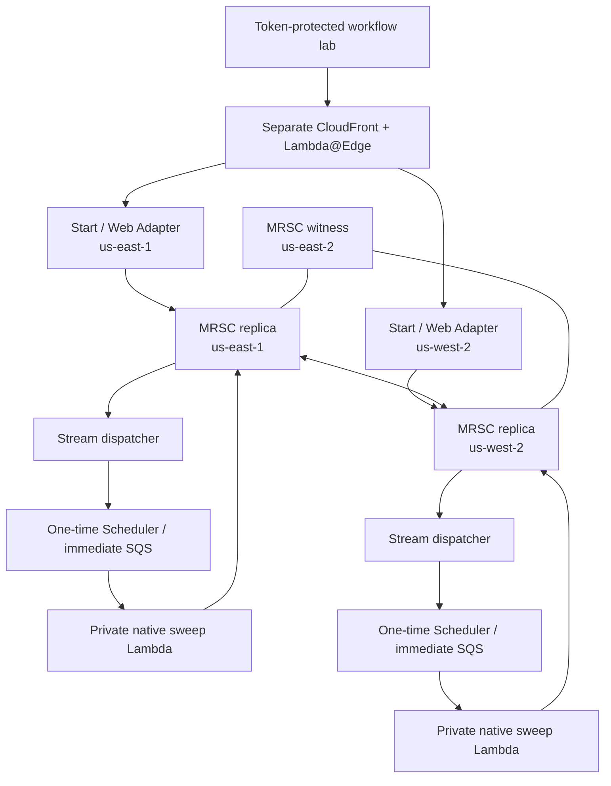

# Workflow integration test branch

> **rc.1:** See [the current upgrade/feature guide](rc1-lab.md) for unified routing,
> ordered delivery and staged migration. Architecture and validation below describe
> the prior integration where explicitly noted.

This branch tests the published **`@ataylorme/tanstack-workflow-aws@0.2.0-rc.0`** package from GitHub Packages, pinned exactly in `package.json` and the lockfile.
It imports the store and its matching bundled workflow/runtime snapshot—not an
independently versioned TanStack Workflow engine. Upstream is experimental.
The infrastructure is adapted from its MIT-licensed examples; see
[`third-party/tanstack-workflow-aws-LICENSE`](../third-party/tanstack-workflow-aws-LICENSE).

## Isolated architecture



The recommended test prefix is `tanstack-wf-test`. It creates **nine stacks**: bootstrap,
app and sweeper in each application region, global ingress in east, and one global-table
stack plus a table-specific CloudFormation execution-role stack in west. The table creates both replicas and the Ohio witness. Existing
`tanstack-ha` resources are not changed. Ordinary MREC tables cannot safely replace MRSC.
The table stack uses a dedicated CloudFormation service role for asynchronous replica creation; its DynamoDB permissions are restricted to the one test table and its children in the three participating regions.
No Aurora DSQL, business database, email, payment, or other external side effect is added.

Every runtime call uses a fresh owner in both `withLeaseOwner` and `leaseOwner`.
HTTP execution is bounded to five seconds, sweeps to Lambda's remaining time minus fifteen
seconds (reserved for durable successor delivery). The two definitions are shared by the web app and native sweepers:

- `validation-v1`: durable region-recording step; deliberate first-attempt failure and
  retry; signal; approval (including rejection); two durable sleeps; final region.
- `timer-v1`: two sleeps and region-recording steps, useful for isolated sweeper recovery.

See [demand-driven wakeup deployment and recovery](workflow-wakeups.md) for migration, idle validation, and rollback. New stacks have no recurring rules; existing legacy stacks require the staged cutover.

## Package authentication

Version 0.2.0-rc.0 is published on **GitHub Packages**, not npmjs.org. The checked-in `.npmrc`
routes only `@ataylorme` packages there and reads authentication from `NODE_AUTH_TOKEN`.
Set that environment variable securely to a GitHub token with `read:packages` and package
access. For an already-authorized GitHub CLI session with that scope:

```sh
export NODE_AUTH_TOKEN="$(gh auth token)"
npm install --save-exact @ataylorme/tanstack-workflow-aws@0.2.0-rc.0
```

Never commit the token. If your npm configuration enforces a minimum release age, a newly
published version may be rejected until that period expires; review the release before
using a one-command `--min-release-age=0` override. Do not disable the policy globally.

CI uses `GITHUB_TOKEN` with `packages: read`. The upstream package must grant this repository
Actions access in its package settings; the permission alone does not grant cross-repository
access. Fork pull requests may also require maintainer validation in a trusted context.

## Deploy

This creates billable resources including a three-region DynamoDB MRSC topology.
Use a sandbox and keep workload small. Do not use the existing main site's prefix.

First configure [package authentication](#package-authentication).

```sh
npm ci
npm run check
npm run smoke
export AWS_PROFILE=your-sandbox-profile
aws sts get-caller-identity  # verify the intended account, not root
export STACK_PREFIX=tanstack-wf-test
export ENABLE_WORKFLOW_TESTS=true
# Optional: host ECR multipart uploads when Docker Desktop's proxy breaks docker push.
export ECR_UPLOAD_MODE=api
node scripts/deploy.ts             # offline plan
node scripts/deploy.ts --execute   # create/update resources and verify HTTP routing
```

The published package includes its compiled JavaScript and declarations, so Docker no longer
needs Git or a source-package prepare build. The lockfile fixes the package tarball and
integrity hash. Docker receives `NODE_AUTH_TOKEN` through a required BuildKit secret;
credentials are not passed as build arguments or saved in image layers. The `api` ECR mode
requires `tar`, validates OCI blob hashes and sizes, and uploads the same saved image to both regions.
Do not rebuild an independent image per region.

`origin-secret` and a **separate workflow API token** are saved with owner-only permissions
under `.deploy/<account>-<prefix>/`. Preserve both for updates. Missing keys on an existing
deployment are not silently rotated. Never commit or publish these files.

## Use and validate

Get `SiteUrl` from the test global stack. The main page contains a workflow lab. Enter the
workflow test token from the protected local `workflow-test-token` file; it stays only in
component memory. It is not in URLs, localStorage, Git, or public frontend assets. Use the
request-region selector to start east, signal west, inspect the approval ID, approve east,
then inspect after demand-driven wakeups finish. Use **New run** between definitions.
A full page reload clears the token and run ID; retain the run ID if you want to inspect later.

API calls to `/api/workflows` require `Authorization: Bearer <test-token>` in addition to
the CloudFront origin guard. Only bounded IDs beginning `test-`, two known definitions,
small test messages, and signal/approval commands are accepted. There is no public sweep,
scan, delete, or arbitrary workflow execution API. This is a shared sandbox token—not
production user/tenant authorization or rate limiting.

```sh
export SITE_URL="$(aws cloudformation describe-stacks --region us-east-1 \
  --stack-name "$STACK_PREFIX-global" \
  --query "Stacks[0].Outputs[?OutputKey=='SiteUrl'].OutputValue | [0]" --output text)"
export ACCOUNT_ID="$(aws sts get-caller-identity --query Account --output text)"
export WORKFLOW_TEST_TOKEN_FILE="$PWD/.deploy/$ACCOUNT_ID-$STACK_PREFIX/workflow-test-token"
node scripts/verify-workflows.ts "$SITE_URL" --execute
```

For controlled worker recovery (briefly disables one regional worker's SQS mapping at a time,
restores it in `finally`, then reverses regions):

```sh
node scripts/verify-workflow-recovery.ts "$SITE_URL" --execute
```

Only run against these isolated test stacks. It verifies both timer steps finish in the
other worker region, not an actual AWS region outage or loss of DynamoDB quorum.

The bounded acceptance runner checks auth, strongly consistent cross-region inspection,
start/signal/approval in both directions, duplicate and concurrent requests, approval
rejection, retry results, contiguous committed event indices, and **actual demand-driven**
completion of consecutive timers. It allows four minutes for eventual GSI discovery and
one-time wakeups, records run IDs/results under `.deploy`, and exits nonzero on any
failure. Local Vitest runtime tests use the installed engine with its in-memory store;
those do **not** establish DynamoDB/MRSC correctness.

For native sweeper diagnostics inspect its dedicated log group; successful Lambda invocation
alone is insufficient. The wrapper logs summaries and deferred `RUN_ERRORED` diagnostics.
The test data and history are deliberately retained for diagnosis. Do not submit secrets or
personal information as workflow payloads.

## Validation evidence and issue reporting

[workflow-validation.md](workflow-validation.md) records historical polling-era outcomes,
not proof of the current wakeup deployment. Use the [wakeup validation commands](workflow-wakeups.md#validation)
for current deployments and retain detailed reports only under ignored `.deploy/`. File
confirmed, minimized library defects in the upstream repository with its pinned SHA,
region topology, reproduction, expected/actual outcome, and sanitized evidence. Do not
publish account IDs, deployed resource names/IDs, ARNs, endpoints, image digests,
tokens, origin credentials, AWS credentials, or raw environment/configuration dumps.
Application wiring mistakes are fixed here, not reported as upstream defects.

Passing this lab does not validate quorum loss, real AWS regional outages, load/throughput,
400 KB limits, every crash boundary, arbitrary external side-effect idempotency, or a DSQL
outbox. Preserve compatible workflow versions for in-flight runs during updates.

## Cleanup

Stop regional stream/queue mappings and disable remaining one-time schedules before teardown, then delete the test global stack, both sweeper
stacks, both app stacks, and both bootstrap stacks. Delete the west workflow-table stack
last. Delete the workflow-deployer role stack only after table operations finish. Use only the **test** prefix. These are destructive actions; the deployment script
never performs them. Retained ECR/S3/logs/edge resources and the MRSC table require explicit
cleanup after recording any evidence. A deleted table stack does not delete the retained
table or stop its storage charges. The main `tanstack-ha` deployment is separate.

## Application events candidate

For PR #4 event testing merged into this branch, see
[application-event-testing.md](application-event-testing.md). The application and
consumer now use the exact published `0.2.0-rc.0` release with lockfile integrity.
