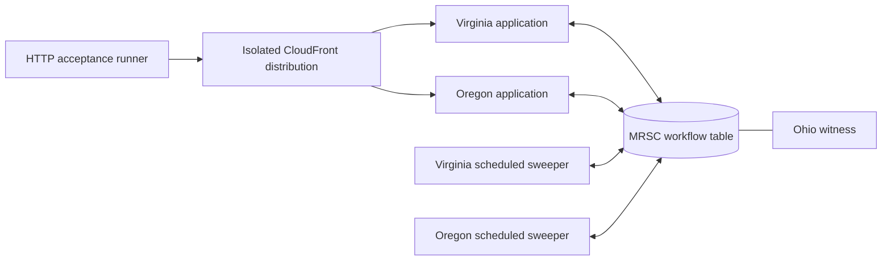

# Workflow AWS validation evidence

Validated on **2026-09-26** against upstream
[`f026a1080b9d7d2e0d25b2735a9c0ce0945c4e2c`](https://github.com/ataylorme/tanstack-workflow-aws/tree/f026a1080b9d7d2e0d25b2735a9c0ce0945c4e2c).

## Deployment

- Branch: `test/tanstack-workflow-aws`.
- Live lab: <https://d20xnhi2h10j2b.cloudfront.net>.
- AWS account: `963564733329`; isolated stack prefix: `tanstack-wf-test`.
- All nine CloudFormation stacks reached `CREATE_COMPLETE`; CloudFront deployed.
- DynamoDB MRSC: `ACTIVE`, `STRONG`, replicas in Northern Virginia/Oregon and an active Ohio witness.
- Application release: `ee9fbc6-1790459916687`. Subsequent changes before validation concerned scripts, tests and documentation, not deployed application code.
- Container digest: `sha256:d69a96f5501ef2b5301aa2b9d39db98246ed5bc1035c7b41b69b75d4d6922b23`.
- Both native Node.js 22 sweepers have code SHA-256 `7YKOSiZfwrsqXwPuI61IiCi/n6wJq57Wa/pS9XBKn84=`.
  Their workflow output uses the fallback release label `development` because these ZIP workers do not set `RELEASE_ID`; the code digest above identifies their deployed artifact.

## Verification

- `npm run check`: production application/edge/sweeper builds, strict TypeScript checks, **77 Vitest tests passed**.
- `npm run smoke`: healthy and simulated-failure production-server checks passed.
- `cfn-lint infra/*.yaml`: passed.
- Upstream's own local suite: **61 tests passed, zero skipped**, using Docker DynamoDB Local; upstream typecheck, build and package checks passed. Local DynamoDB is not evidence of MRSC behavior.
- GitHub Actions [run 36275044331](https://github.com/ataylorme/tanstack-start-aws-high-availability/actions/runs/36275044331): passed.
- Live HTTP routing: both region preferences, SSR, health and all seven supported HTTP methods passed. Workflow lab markup is present.
- Live workflow API: missing authentication rejected with HTTP 401; responses verified `no-store` and the requested serving region.
- Both cross-region runs: opposite-region immediate read, signal delivery, approval, intentional retry succeeding on attempt 2, duplicate signal suppression, two scheduled durable sleeps, contiguous event indices and identical final regional reads passed.
- Concurrent starts/signals from both regions: one signal resolution, approval rejection and preserved payload passed.

| Scenario | Durable run ID | Events |
| --- | --- | --- |
| Virginia start, Oregon signal | `test-c45fe1fc-ea1d-4d8c-82e7-f5a00b179ea5` | 14 |
| Oregon start, Virginia signal | `test-5b666b16-58c7-49af-96cf-105a3369edf9` | 14 |
| Concurrent duplicates and rejection | `test-08b670aa-cb6c-41be-bd0d-93b4d6cec397` | 8 |

Machine-readable workflow results are in [workflow-validation.json](workflow-validation.json).

## Scheduled-worker recovery

Both directions passed without manually invoking a sweeper:

| Disabled schedule | Worker completing both sleeps | Run ID |
| --- | --- | --- |
| Virginia | Oregon | `test-recovery-0cb9b12a-3844-4be0-b67c-4f29b9e782a4` |
| Oregon | Virginia | `test-recovery-f2e20762-9400-4c96-83fe-d0d657e5826e` |

Both schedules were restored to `ENABLED` by the recovery runner. See [workflow-recovery.json](workflow-recovery.json). The workflow acceptance suite overlapped the first recovery scenario, so its timer work also completed through Oregon while Virginia scheduling was paused. This demonstrates worker-schedule unavailability, not an actual regional outage.

## Findings reported upstream

1. [Issue #2: development dependency advisory](https://github.com/ataylorme/tanstack-workflow-aws/issues/2): upstream Vitest 3.2.7 is affected by GHSA-82fw-gwwq-j7x9. Two moderate development audit entries; production dependency audit reported zero. No exploitation was attempted.
2. [Issue #3: document an explicit MRSC CloudFormation service role](https://github.com/ataylorme/tanstack-workflow-aws/issues/3): the first deployment using caller temporary credentials failed replica provisioning with `UnrecognizedClientException`, although direct authenticated calls worked. An explicit, table-scoped CloudFormation role resolved deployment. This is a deployment/documentation finding, not proof of a workflow-runtime defect or universal incompatibility with `aws login`.

A transient ECR upload connection failure was recovered with smaller upload parts and idempotent image publishing. Initial CloudFront DNS lookup failure disappeared after distribution deployment completed. Neither was attributed to the library.

## Scope and limitations

No upstream runtime defect was observed in these bounded scenarios. This is not production certification, load testing, a real AWS regional outage, or a quorum-loss experiment. Browser interactions were not automated; HTTP/API behavior and rendered markup were checked. Test runs intentionally contain no sensitive application data.

The existing main deployment remained healthy at release `a603cab-update`; its resources were not updated. The isolated lab remains running and incurs AWS charges. The API token remains in the owner-only local file `.deploy/963564733329-tanstack-wf-test/workflow-test-token`, not in this repository. See [workflow-testing.md](workflow-testing.md) for use, repeatable validation and teardown.
